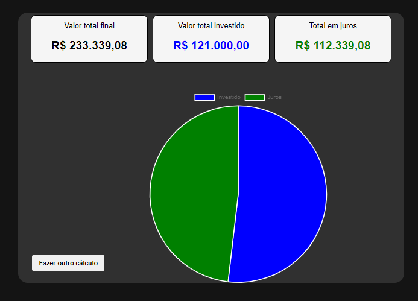

<h1>Calculadora de juros compostos com aportes mensais</h1>
	
Esta é uma calculadora de juros compostos que leva em consideração os aportes mensais. Com ela, você poderá calcular quanto seu dinheiro irá render ao longo do tempo, levando em consideração não apenas o valor inicial, mas também os aportes mensais que serão adicionados ao investimento.

<h2>Como usar a calculadora</h2>
	<ol>
		<li>Informe o valor inicial do investimento;</li>
		<li>Informe o valor dos aportes mensais;</li>
		<li>Informe a taxa de juros anual;</li>
		<li>Informe o período de investimento em anos;</li>
		<li>Clique no botão "Calcular".</li>
	</ol>
	
A calculadora irá então mostrar o valor final do investimento após o período informado, levando em consideração os aportes mensais e a taxa de juros compostos.

    

<h3>Comentário</h3>

Este é um dos meus primeiros projetos de desenvolvimento, e por isso, pode conter muitos erros e commits. Quando comecei a trabalhar neste projeto, estava aprendendo a utilizar novas tecnologias e técnicas de desenvolvimento, o que pode ter levado a alguns erros e problemas no código.
 
No entanto, mantive todos os commits anteriores, mesmo aqueles que continham erros, como uma forma de documentar o meu progresso e evolução no desenvolvimento do projeto. Espero que isso possa ajudar outras pessoas que estejam iniciando na área a entender que erros e ajustes são uma parte natural do processo de desenvolvimento, e que é possível aprender e evoluir a partir deles."

