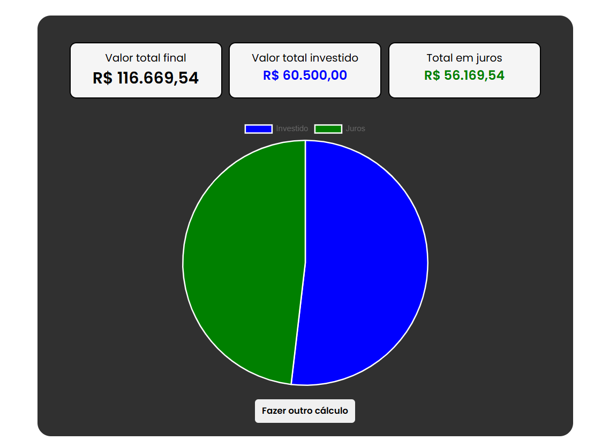

<h1>Calculadora de juros compostos com aportes mensais</h1>
	
Esta é uma calculadora de juros compostos que leva em consideração os aportes mensais. Com ela, você poderá calcular quanto seu dinheiro irá render ao longo do tempo, levando em consideração não apenas o valor inicial, mas também os aportes mensais que serão adicionados ao investimento.

<h2>Como usar a calculadora</h2>
	<ol>
		<li>Informe o valor inicial do investimento;</li>
		<li>Informe o valor dos aportes mensais;</li>
		<li>Informe a taxa de juros mensal;</li>
		<li>Informe o período de investimento em anos;</li>
		<li>Clique no botão "Calcular".</li>
	</ol>
	
A calculadora irá então mostrar o valor final do investimento após o período informado, levando em consideração os aportes mensais e a taxa de juros compostos.

    